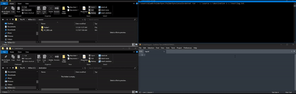

<div style="text-align: center;">

<h2 align="center">



FolderSync
</h2>

  <p style="text-align: center;">
    A command line program that will sync a directory from a source directory (one way) at a set interval.
  </p>
</div>

### Features
* Dependency Injection
* Tests

### Built With
[![C#]][C#-url]

### Dependencies Used
* Moq
* XUnit
* Serilog

<!-- GETTING STARTED -->
## Getting Started

### Prerequisites
* **.NET 8 SDK:** You can download it from the [Microsoft website](https://dotnet.microsoft.com/download).

### Installation (for local)

1. **Clone the repo:** Use the following command to clone this repo to your local machine
   ```sh
   git clone https://github.com/BlueBatRay2/FolderSync
   ```
   **Alternative method:** download zip from https://github.com/BlueBatRay2/FolderSync and extract.
   <br/><br/>
2. **Change directory to console project:** Use the following command to go to the console directory
   ```sh
   cd FolderSync
   cd FolderSyncConsole
   ```

### How to Use
1. **Format:** FolderSync SourceDirectory ReplicaDirectory SecondsPerInterval

* `string` *SourceDirectory*: An existing directory path that you want to clone
* `string` *ReplicaDirectory*: The clone directory path (must have write permissions here)
* `int` *SecondsPerInterval*: how often you want to sync. Must be greater than 0
* `string` *LogPath*: Path to save all logging events
 
   ```sh
  (windows example)
   dotnet run -- c:\source c:\destination 600 c:\log.txt
   ```

[C#]: https://img.shields.io/badge/c%23-%23239120.svg?style=for-the-badge&logo=c-sharp&logoColor=white
[C#-url]: https://learn.microsoft.com/en-us/dotnet/csharp/

## Possible Improvements Considered

- Save out calculated hashes in source for reuse
- Add more thorough unit tests for complete code coverage


